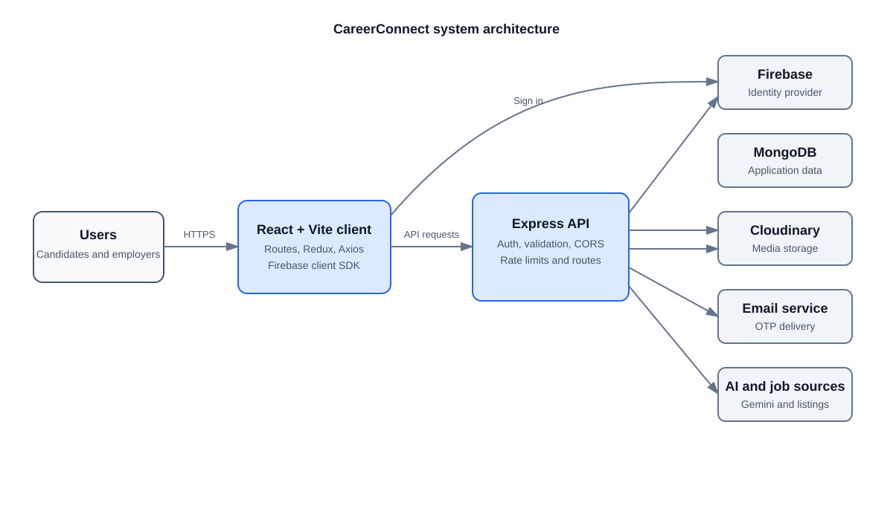

# CareerConnect architecture diagrams

These diagrams describe the current React, Express, MongoDB, Firebase, and third-party service structure. GitHub and Mermaid-enabled Markdown previews render every diagram below.

## 1. System architecture



## 2. Authentication and account recovery

```text
User → React client → reCAPTCHA token → Express API → reCAPTCHA verification
                                            │
                                            ├─ Registration / reset password
                                            │  → hashed OTP in MongoDB → Email service → User
                                            │  → verified proof → JWT / session
                                            │
                                            └─ Firebase / Google sign-in
                                               → Firebase identity verification → MongoDB user
                                               → JWT / session
```

## 3. Recruitment lifecycle

```text
Employer → Create job / internship → Published listing → Candidate → Application
                                                        ↓
Candidate response ← Job offer ← Interview ← Assessment ← Employer review
        │
        ├─ Accept → Application marked Hired
        └─ Reject → Application marked Rejected
```

## 4. Resume and course upload flow

```text
Authenticated upload → Multer limits → File signature validation
                             │                 │
                             └─ Invalid ───────┴─ Mismatch → Reject request
                                               │
                         Resume → Cloudinary → MongoDB metadata
                    Course file → Temporary disk → Cloudinary → MongoDB metadata
```

## 5. Core data relationships

| Main entity | Related entities |
| --- | --- |
| User | Student, Fresher, Professional, or Employer profile; resumes; applications; notifications; course progress |
| Employer profile | Jobs, internships, assessments, and job offers |
| Job / Internship | Applications; job can also have assessments |
| Assessment | Assessment submissions |
| Application | Candidate, opportunity, and optional job offer |
| Course | Course content and learner progress |

## Viewing the diagrams in VS Code

This document now uses an SVG architecture diagram and plain Markdown flows, so it renders in VS Code without a Mermaid extension.
